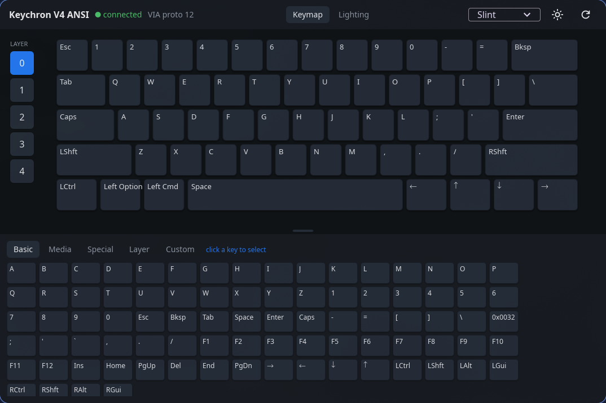
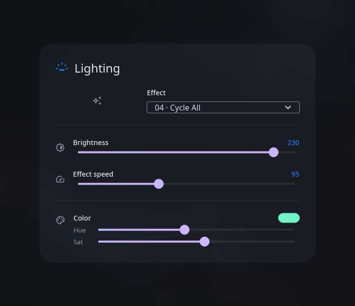
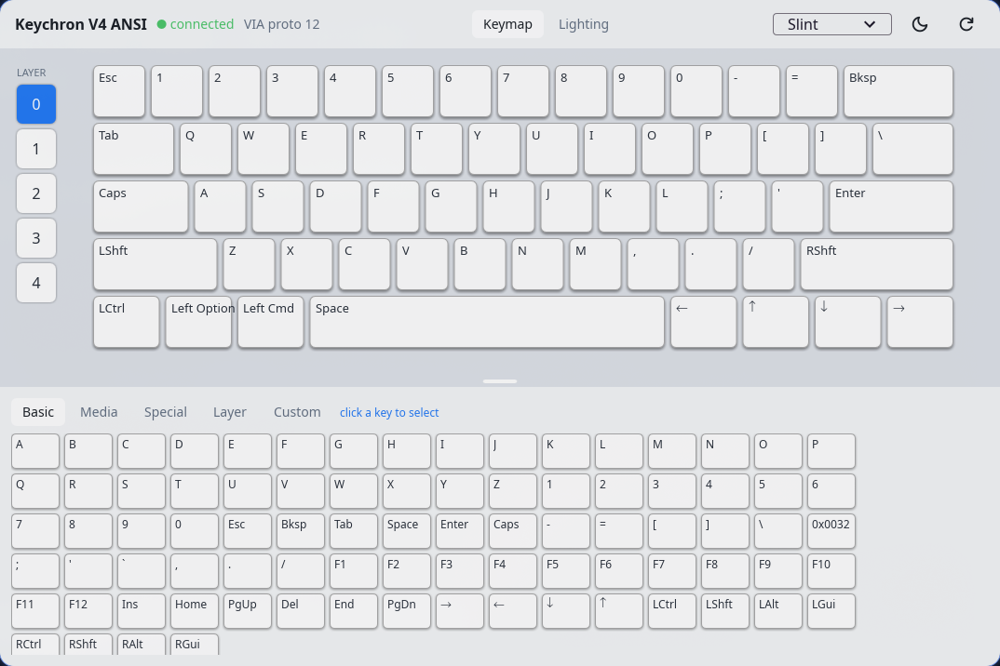

# stubby

A **native, non-Electron** Keychron launcher for Linux. Talks to the keyboard
directly over raw HID using the **VIA protocol** — no browser, no WebHID, no
Chromium. One small binary.



Built on Keychron's own open-source releases:

- [`Keychron/keyboards`](https://github.com/Keychron/keyboards) — VIA device
  definitions (GPL-3.0). Bundled: `stubby/src/v4_ansi.json`.
- [`Keychron/qmk_firmware`](https://github.com/Keychron/qmk_firmware) — source of
  truth for the HID command bytes.

## Features

- **Live keymap editing** — click a key, pick a keycode, it's written to the
  board immediately (dynamic keymap, all 5 layers). Basic / media / special /
  layer (MO, TO, DF, TG, OSL, TT, LT) / Keychron custom keycodes.
- **Lighting** — effect, brightness, speed, and colour for the RGB backlight
  over the VIA3 custom channel (rgb_matrix). Values apply live while dragging;
  EEPROM save happens on release, so flash isn't hammered.
- **Material 3 UI** ([Slint](https://slint.dev), material style) — light/dark
  toggle and an accent seed colour that derives the whole tonal palette.

| Lighting | Light mode |
| --- | --- |
|  |  |

## Hardware

- **Keychron V4 ANSI**, USB `3434:0340`, 5×14 matrix, VIA protocol 12.
- Raw-HID (VIA) interface = usage page `0xFF60`, usage `0x61` — found by usage
  page, not a fixed `/dev/hidrawN`.

Other VIA-capable Keychrons should mostly work by swapping the bundled
definition JSON; only the V4 ANSI is wired up today.

## Setup

### 1. Grant HID access (one-time, needs sudo)

`/dev/hidraw*` is root-only by default. Install the udev rule, then replug the
keyboard (or reload rules):

```sh
sudo cp 99-stubby-keychron.rules /etc/udev/rules.d/
sudo udevadm control --reload-rules && sudo udevadm trigger
```

The rule grants the `wheel` group access. (Plain logind `uaccess` tagging does
not reliably cover this keyboard's hidraw node.)

### 2. Get a binary

Grab `stubby-linux-x86_64` from the
[releases](https://github.com/lubabs770/stubby/releases), or build it:

```sh
cd stubby
cargo build --release --bin stubby
```

There's also `stubby-probe`, a minimal transport check that prints the
protocol/firmware version and layer count:

```sh
cargo run --bin stubby-probe
```

## Layout

- `stubby/src/via.rs` — raw-HID VIA transport (keymap get/set, layer count,
  lighting over the rgb_matrix custom channel)
- `stubby/src/kle.rs` — KLE layout decoder
- `stubby/src/keycodes.rs` — keycode names + picker palette
- `stubby/src/slint_main.rs` + `stubby/ui/app.slint` — the app (bin `stubby`)
- `stubby/src/main.rs` — earlier egui prototype (bin `stubby-egui`, kept for
  reference)
- `stubby/src/v4_ansi.json` — vendored VIA definition (GPL-3.0)

Dev helpers: `STUBBY_PAGE=1` opens on the Lighting page, `STUBBY_DARK=0`
starts in light mode.

## Roadmap

- [x] VIA transport (`stubby-probe`)
- [x] Read/write dynamic keymap (remap keys, all layers)
- [x] Parse VIA definition layout → render key grid
- [x] Slint Material 3 UI: light/dark + accent theming
- [x] Lighting controls (effect / brightness / speed / colour)
- [ ] Keycap legend polish
- [ ] More boards (definition loading beyond the bundled V4)
